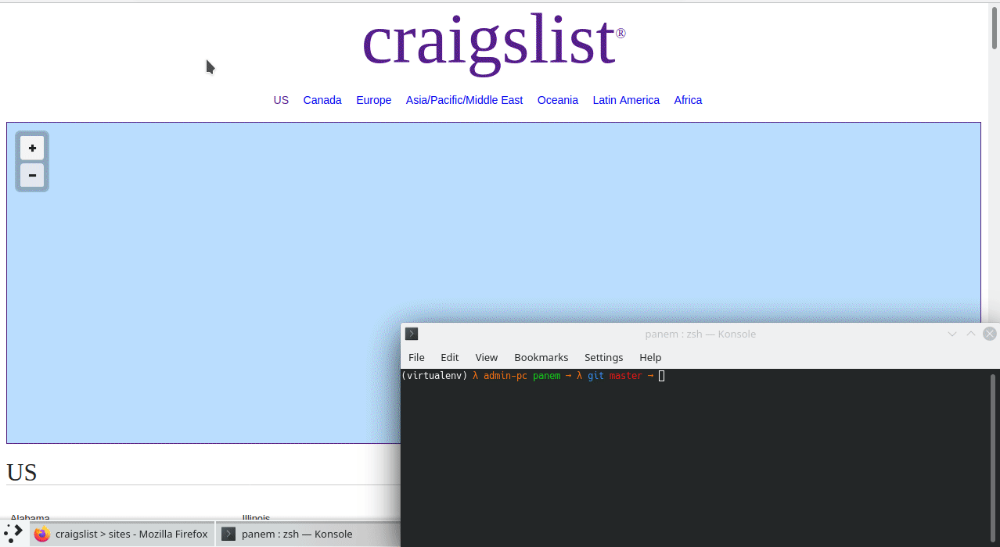

<p align="center">
  <a href="" rel="noopener">
 </a>
</p>
<h3 align="center">Panem</h3>

<div align="center">

  []() 
  [](LICENSE.md)

</div>

---

<p align="center"> A beermoney assistant.
    <br> 
</p>

## 📝 Table of Contents
- [Problem Statement](#problem_statement)
- [Idea / Solution](#idea)
- [Dependencies / Limitations](#limitations)
- [Future Scope](#future_scope)
- [Setting up a local environment](#getting_started)
- [Usage](#usage)
- [Technology Stack](#tech_stack)
- [Contributing](../CONTRIBUTING.md)
- [Authors](#authors)
- [Acknowledgments](#acknowledgments)

## 🧐 Problem Statement <a name = "problem_statement"></a>
Everyone would like some extra money at the end of the month, but only a select few have the time to scroll mindlessly through websites such as Craigslist to find quick gigs. This is especially true for individuals who live outside the US, where opportunities such as focus groups or research studies that can be done in return of monetary gain happen very seldomly.
- IDEAL: A program that allows users to carefully select which opportunities they're looking for and where. Results that come from multiple sources. Runs fast.
- REALITY: Currently only works with Craigslist, and is far from optimal (slow).
- CONSEQUENCES: If this program is abused, many opportunities will be taken in an instant, not allowing individuals who are unaware of the existence of Panem not be able to compete with the speed of which this program finds results (although it's slow, it's still significantly faster than a human). 

## 💡 Idea / Solution <a name = "idea"></a>
Panem aims to make beermoney more accessible to everyone by crawling through carefully selected places that have high probabilities of yielding opportunities that will likely make you some money.

## ⛓️ Dependencies / Limitations <a name = "limitations"></a>
- Currently only finds opportunities on Craigslist
- Works in a faulty manner outside cities in the US
- Takes a very long time to run (1.8 minutes per city, there are 714 which means the program will take 21.4 hours to complete)
- Not very customizable
- Universal fix for scrollback buffering

## 🚀 Future Scope <a name = "future_scope"></a>
I will work on all of the listed limitations and frequently update this program. I would also like to make this program's scale larger, by making it desireable to a large audience. 

## 🏁 Getting Started <a name = "getting_started"></a>
These instructions will get you a copy of the project up and running on your local machine for development 
and testing purposes.

### Installing

#### Cloning the repo

```
git clone https://github.com/Seanmusse/Panem.git
```

#### Change into the program's directory
```
cd Panem/
```

#### Install the required dependencies
You must have Python installed to do this:

```python
pip3 install -r requirements.txt
```

#### Run the program
```python
python3 panem.py
```


## 🎈 Usage <a name="usage"></a>
If the program is run without any arguments (`python3 panem.py`), it will scrape the opportunities from every city on Craigslist (714). Please bear in mind that this will take a long time (approximately 21.4h) to complete. 
However, specific searcher may be performed. You can provide a singular city (`python3 panem.py "https://losangeles.craigslist.org/"`)or multiple (`python3 panem.py ""https://losangeles.craigslist.org/" "https://newyork.craigslist.org/" `) as long as the URLs are valid, inside quotations and separated by a singular space.

## ⛏️ Built With <a name = "tech_stack"></a>
- [BeautifulSoup](https://www.crummy.com/software/BeautifulSoup/) - Scraper


## ✍️ Authors <a name = "authors"></a>
- [@Seanmusse](https://github.com/Seanmusse/) - Idea & Initial work

See also the list of [contributors](https://github.com/Seanmusse/Panem/graphs/contributors) 
who participated in this project. All contributions are welcome, I encourage everyone to make a PR :) 

